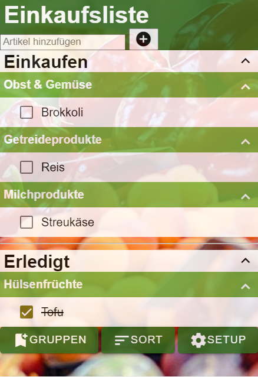

# Einkaufsliste React-Code
Dieses Repository enthält den React-Code für die Einkaufsliste, welche im Modul "Grundlagen der Programmierung" des Kurses "Mobile App Development" entwickelt wird.

Die einzelnen Entwicklungsschritte sind in den Dateien "lektion1.md" bis "lektion7.md" enthalten.

Die Aufgabe der Kursteilnehmer:innen ist es, den React-Code der Einkaufsliste jeden Tag ein wenig weiterzuentwickeln, um das Datenmodell mit dem HTML-UI zu "verheiraten".

[Aufgaben Lektion 1](lektion1.md)  

Das Endergebnis kann z.B. so aussehen 
