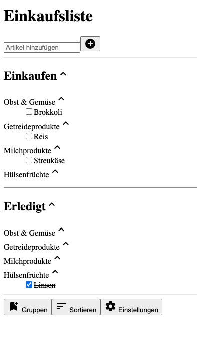

# React
Hinweise zur Bearbeitung:
- Achte auf einen sauberen Quellcode, insbesondere Einrückungen sind wichtig!
- Um beim Benutzen z.B. der `map()` und `filter()` Funktionen weiterhin `this` nutzen zu können(z.B. für `this.props`) kannst du
  diesen Funktionen als zweites Argument `this` mitgeben.
- Javascript code, also z.B. Zugriffe auf `this.props` unterscheiden sich von Text bzw. HTML durch umrunden mit geschweiften Klammern.
Also z.B. `{this.props.gruppe.name}` 
---
## Lektion 1

1.) Importiere das Datenmodell `Artikel.js`, `Gruppe.js` und `App.js` mithilfe von  Skript Tags

2.) In `ShoppingTag.js`, füge an ein paar Artikel und Gruppen hinzu. 
Benutze dafür `App.gruppeHinzufuegen()` und `<gruppenVariable>.artikelHinzufuegen()` 

3.) In `ShoppingTag.js` an Stelle der GruppenTags in der "Einkaufen" Sektion, nutze die gruppenListe des App Objekts und die map Funktion, um für 
jede Gruppe ein GruppenTag zu erstellen. Gebe diesem folgende props mit:
- key, mit dem Wert der Gruppen id
- gruppe, mit dem Gruppenobjekt als Wert

4.) In `GruppenTag.js` ersetze den Platzhalter durch den tatsächlichen Namen der Gruppe.
Diesen erhältst du indem du über `this.props.gruppe` auf das Gruppenobjekt zugreifst.

5.) In `GruppenTag.js` an Stelle der ArtikelTags, nutze die artikelListe des gruppe Objekts(`this.props.gruppe`) und die map Funktion 
um für jeden Artikel einen ArtikelTag zu erstellen. Gebe diesem folgende properties mit:
- key, mit dem Wert der artikel id
- artikel, mit dem Artikelobjekt als Wert

6.) In `ArtikelTag.js` ersetze den Platzhalter durch den tatsächlichen Namen des Artikels.
Diesen erhältst du indem du über `this.props.artikel` auf das Artikelobjekt zugreifst.

7.) In `ShoppingTag.js` füge den GruppenTags eine weitere property hinzu:
- erledigt, mit den Wert true oder false, je nachdem ob an der Stelle die erledigten oder die noch zu erledigenden Artikel angezeigt werden sollen
In der "Einkaufen" Sektion ist diese property also `true`.
Erstelle nun in der Erledigt Sektion analog zu Aufgabe 3 für jede Gruppe ein GruppenTag, aber setze hier erledigt auf false.

8.) In `GruppenTag.js` erstelle in der render Funktion, vor dem `return` Statement eine Liste mit allen Artikeln bei denen der gekauft Status gleich der erledigt property ist.
Nutze hierzu die `artikelListe` und die `filter()` Funktion.
Erstelle nun anstatt für alle Artikel wie in Aufgabe 5 beschrieben nur noch für alle Artikel aus dieser List ein ArtikelTag.

9.) In `ArtikelTag.js` setze den `checked` Parameter der checkbox gleich dem `erledigt` Wert des Artikels.
Wenn der `erledigt` Wert des Artikel `true` ist, zeige statt dem Artikelnamen, den Artikelnamen umgeben mit `<s></s>` an.

---

## Endergebnis
Das Endergebnis sollte ungefähr so aussehen:  
>