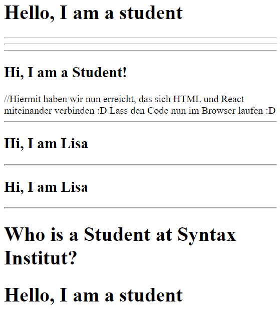

#React
Hinweise zur Bearbeitung:
- Achte darauf Komponentennamen immer in Großbustaben zu schreiben
- Dies ist eine Übungsaufgabe und dient nur als **Zusatzaufgaben**. Das Bearbeiten der
  **Einkaufslistenapp** ist das jeweilige Ziel der einzelnen Lektionen und sollte als Priorität angesehen werden.
- Achte auf einen sauberen Quellcode, insbesondere Einrückungen sind wichtig!
---

## Lektion 2a Übungsaufgaben

1. Schreibe eine `funktionale Komponente`, diese soll `Student` heißen und im return eine 
`<h2> mit Hi, I am a student!</h2>` ausgeben.
---

2. Schreibe die Funktion nun in eine `Klassen Komponente` um: <br>
```
class Example extends React.Component {
  render() {
    return <h2>Hi, ich bin ein Beispiel !</h2>
  }
}
```
---

3. Schreibe die folgende funktionale Komponente in eine `Klassen Komponente` um.
```
class Example  extends React.Component {
  render() {
    return <h2>Hi, ich bin ein Beispiel !</h2>
  }
}
```
---

4. Wir haben nun zwei Komponenten mit den Namen `Programmer` und `Student` gebildet, diese Komponenten wollen wir nun in unserem "root" Element rendern.
   Kopiere die Komponente Student nun in die dafür vorgesehene Spalte ein und füge folgenden Code hinzu:
   `ReactDOM.render(Student, document.getElementById('root'));`
---

5. a) Props: Füge nun deiner funktionalen Komponente Student `Attribute` hinzu, indem du props verwendest. <br> <br>
   b) Eigenschaften (properties) können wir auch der `class Komponente hinzufügen`.
---

6. Nun wollen wir unsere Komponente Student verschachteln. Unsere Komponente Student soll `in eine Komponente Institut verschachtelt` werden.
___

##Endergebnis
Am Ende sollte das Ganze ungefähr so aussehen:  
