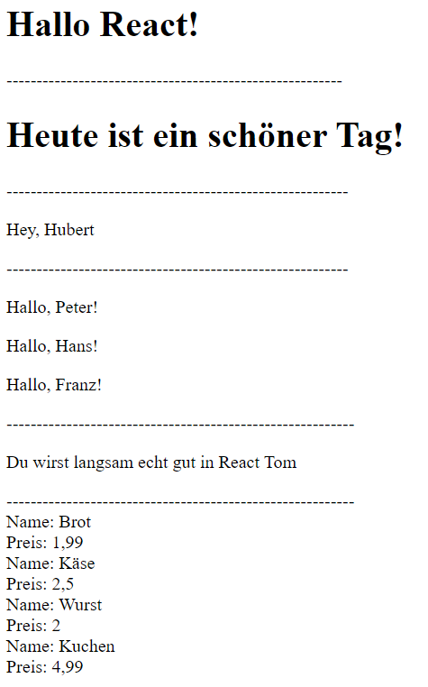

# React

Hinweise zur Bearbeitung:

- Dies ist eine Übungsaufgabe und dient nur als **Zusatzaufgabe**. Das Bearbeiten der
  **Einkaufslistenapp** ist das jeweilige Ziel der einzelnen Lektionen und sollte als Priorität angesehen werden.
- Achte auf einen sauberen Quellcode, insbesondere Einrückungen sind wichtig!

---

## Lektion 2b - Übungsaufgaben

1. Schreibe eine `Funktion Hallo` die dann `Hallo React!` ausgeben soll.  
**Hinsweis:** Um Hallo React auszugeben sollte das Ganze in der Funktion so aussehen: `return <h1>Hallo React!</h1>;`
---
2. Schreibe eine `Klasse Tag` die von React.Component erbt und ausgibt `Heute ist ein schöner Tag!`.  
**Hinweis:** Denke daran, dass du eine render Funktion in der Klasse brauchst!  
**Hinweis 2:** Um "Heute ist ein schöner Tag" auszugeben sollte das Ganze in der Funktion so aussehen: `return <h1>Heute ist ein schöner Tag!</h1>;`
---
3. Schreibe nun eine `Funktion` mit dem Namen `Hey`. Diese soll deinen Namen mit Hilfe des `Schlüsselworts props` in folgender Form ausgeben: `Hey, (dein Name)`.  
**Hinweise:** Die Verwenung von Props in einer Funktion sollte wie folgt aussehen: `function Hey(props) { }`.
Vergesse hier return nicht!
---
4. Schreibe hier eine `Funktion` mit dem Namen `Wiederholt`. Diese soll mehrere Namen ausgeben. Die Namen darfst du frei wählen.  
**Hinweis:** Wenn du nicht weißt, wie du mehrere Namen wiedergeben sollst, dann schau dir mal in `Aufgabe 6` die vorgegebene `App Funktion` an.
---
5. Sehr gut! Langsam wirst du immer besser in React! Schreibe nun eine `Klasse Vorname`, welche von React.Component erbt und mit Hilfe von `props` 
deinen Namen in folgendem Satz ausgibt: `Du wirst langsam echt gut in React (dein Name)`.
**Hinweis:** Um props in Klassen zu verwenden benutze einfach folgende Zeile in deinem return: `{this.props.name}`
---
6. Als allerletztes musst du nun nur noch `ReactDOM.render` schreiben können, so wie es in allen bisherigen Aufgaben vorgegeben war. Schau dir dennoch mal
den Code von Aufgabe 6 an. So ähnlich könnte eine Einkaufsliste aussehen!

___
##Endergebnis
Am Ende sollte das Ganze ungefähr so aussehen:  
