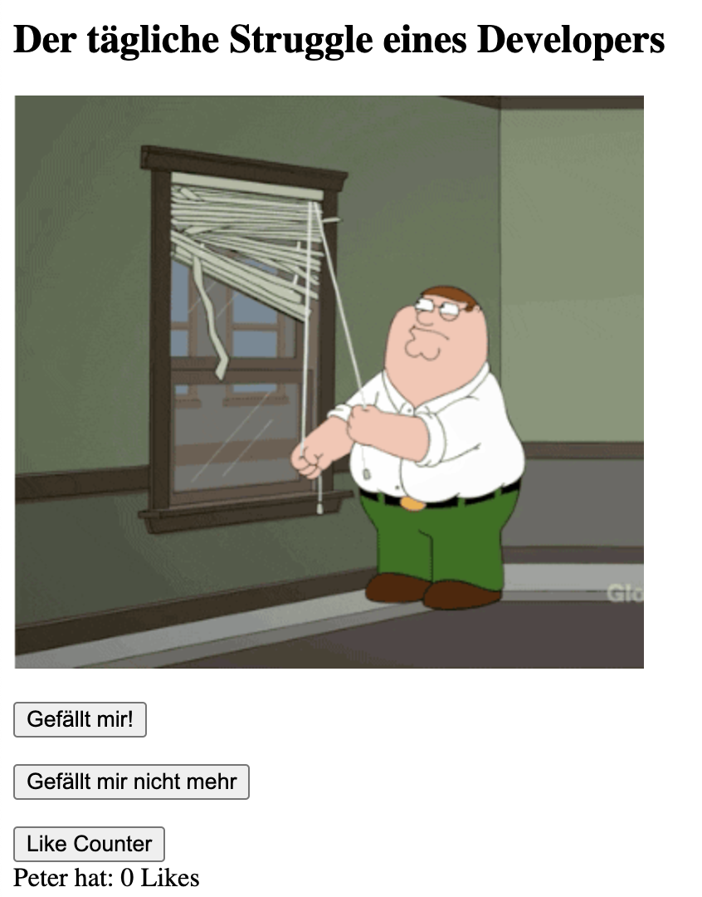
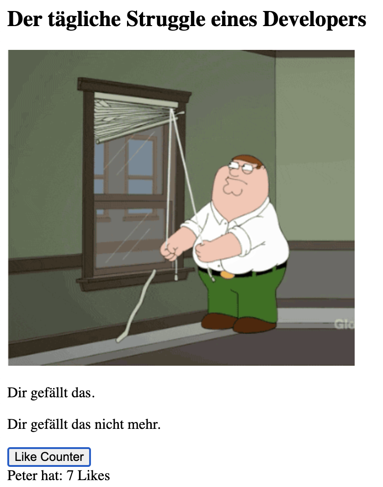

# React

Hinweise zur Bearbeitung:

- Dies ist eine Übungsaufgabe und dient nur als **Zusatzaufgaben**. Das Bearbeiten der
  **EinkaufslistenApp** ist das jeweilige Ziel der einzelnen Lektionen und sollte als Priorität angesehen werden.
- Achte darauf, dass in deinem Projekt der Ordner `lib` mit den Dateien `react.development.js`,
`react-dom.development.js` und `react-dom.development.js`vorhanden ist.
- Achte auf einen sauberen Quellcode, insbesondere Einrückungen sind wichtig!
---

## Lektion 3

1. Importiere hier mit Hilfe eines `<script>`-Tags die `Like_Button.js`, `Unlike_Button.js`, `Counter.js`
---

2. Füge `<script>`-Tags des Types `"text/babel"` innerhalb des `<body>`-Tags des hinzu.
---
3. Nutze nun `ReactDOM.render()` innerhalb der `<script>`-Tags um die `Like_Button.js`, `Unlike_Buttons.js` und `Counter.js` mithilfe von React anzuzeigen.  
<br>***Hinweis***: Um mehrere Elemente in einer `ReactDOM.render()`-Methode zu rendern, können diese von einem `<div>`-Element 
umschlossen werden.  
In diesem Beispiel müssen also die Klassen `<Like_Button/>`, `<Unlike_Buttons.js/>` und `<Counter.js/>` von einem `<div>`-Element
umschlossen werden.
---

4. Gehe nun in die Komponenten `Like_Button.js` und `Unlike_Button.js` und verändere jeweils:
  - Füge eine if-Anweisung hinzu, die den state auf true checkt.  
     Füge nach dem `if`-Audruck einen return-Wert hinzu, der angezeigt wird, wenn sich der `state` ändert.
     Dieser soll z.B. "Dir gefällt das." zurück geben.
    - Schreibe an der passenden Stelle HTML Code. Dieser beinhaltet einen `div`-Tag.
      Dieser beinhaltet wiederum als einziges Element einen button mit dem Eventlistener `onClick`.
      <br> Dieser Eventlistener führt folgenden Code aus:  
    ```{() => this.setState({ liked: true })}```
---
  
5. Gehe nun in die Komponente `Counter`.js und verändere:
- Im Konstruktor, setze den initialen state von `counter` auf `0`. 
  Hierfür, kann man sich an dem Konstruktor der Komponenten `Like_Button.js` und `Unike_Button.js` orientieren. 
- Nutze nun innerhalb der Funktion `increaseCounter()` die Methode `setState()`. 
  Diese soll den `counter` um eins erhöhen. (`counter+1`)
- Schreibe als letzten Schritt an der passenden Stelle HTML-Code. Dieser beinhaltet einen `<div>`-Tag.
  Dieser beinhaltet wiederum zwei HTML-Elemente einen Button mit dem Eventlistener `onClick`.
  Dieser Eventlistener führt folgenden Code aus: `{this.increaseCounter}`  
Das zweite Element soll den Counter anzeigen. Dieser counter kann mit Hilfe von ```{this.state.counter}``` angezeigt werden.
---

## Endergebnis

Das Endergebnis sollte ungefähr so aussehen:
> 

Durch Klicken auf die ersten beiden Buttons, soll der jeweilige Button verschwinden und eine andere Nachricht angezeigt werden.
<br> Der dritte Button soll den Zähler bei jedem Klick um +1 erhöhen. 

> 
