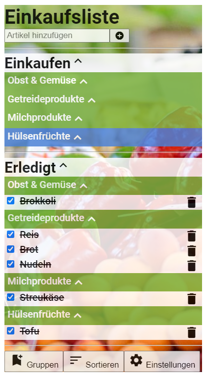

# React
Hinweise zur Bearbeitung:
- Achte auf einen sauberen Quellcode, insbesondere Einrückungen sind wichtig!
- Nutze beim Erstellen von Methoden die Pfeilfunktion-Schreibweise `name = (parameter) => {code}` statt der üblichen Schreibweise.
  Diese Schreibweise ermöglicht es, mit `this` immer die Komponente anzusprechen, in der die Methode steht, statt die in
  der sie tatsächlich ausgeführt wird. Das ist wichtig, wenn wir Funktionen als props an andere Komponenten übergeben.
---

## Lektion 4
1. Erstelle in `ShoppingTag.js`  eine Methode `artikelChecken()`, die ein `Artikel`-Objekt als Parameter erhält.
Die `gekauft`-Variable dieses Artikels soll sich beim Ausführen der Methode verändern(von `true` zu `false` oder
andersrum). Rufe ausserdem einmal die `setState`-Methode mit `this.state` auf, damit die Komponente neu
gerendert wird. 
   1. Programmiere Folgendes in `ShoppingTag.js`:  
      Gehe zum `<GruppenTag>` und gib die Methode `this.artikelChecken` als `checkHandler`-Prop weiter.
   2. Programmiere Folgendes in `GruppenTag.js`:  
      Gehe zum `<ArtikelTag>` und gib das Prop `this.props.checkHandler` als `checkHandler`-Prop weiter.
   3. Programmiere Folgendes in `ArtikelTag.js`:  
      Gehe zu `<input type="checkbox"/>` und füge `onChange={}` hinzu. Schreibe zwischen die geschweiften Klammern eine Pfeilfunktion, 
      die `this.props.checkHandler()` mit `this.props.artikel` als Argument aufruft.

Ergebnis: du solltest nun die Artikel in der Einkaufsliste durch anklicken von "Einkaufen" zu "Erledigt" verschieben
können und andersrum.

2. Schreibe in `ShoppingTag.js` eine Methode `artikelHinzufuegen()` und programmiere das `onClick` Attribut des
Plus-Buttons so, dass die Methode ausgeführt wird. Füge dem Eingabefeld daneben ein Attribut `id` mit einem
sinnvollen Wert hinzu. 
   1. In der Methode `artikelHinzufuegen()`, lese nun dieses Eingabefeld aus (mithilfe von `document.getElementById` und `eingabefeld.value`). 
   Hinweis: Beim Auslesen eines Textes, den der Nutzer eingeben kann, macht es meistens Sinn den Text zu "cleanen",
   also z.B. Leerzeichen vorne und hinten zu entfernen und zu überprüfen, ob der Text in dem gegebenen Kontext überhaupt
   Sinn macht (z.B. ob er leer ist).
   2. Ermittle mit `App.gruppeFinden(App.aktiveGruppe)`, welche Gruppe gerade aktiv ist und speichere sie in einer
   Variablen, z.B. `aktiveGruppe`. 
   3. Füge dieser `aktiveGruppe` einen neuen Artikel mit `artikelHinzufuegen()` hinzu.  
   Verwende als Argument den Namen, den Du aus dem Eingabefeld mit `value` ermittelt hast. 
   4. Setze danach den Inhalt des Eingabefeldes zurück und nutze die `focus()`-Methode, um das Eingabefeld zu fokussieren, 
   sodass man direkt den nächsten Artikel eintippen kann.

Ergebnis: du solltest nun einen Artikel in das Eingabefeld eingeben und per Klick auf den Plus-Button der aktiven Gruppe
hinzufügen können. Danach sollte sich das Eingabefeld leeren.

3. Schreibe im `GruppenTag.js` eine Methode `artikelEntfernen()`, die einen `artikelNamen` als Parameter erhält.
   1. rufe `this.props.gruppe.artikelEntfernen()` auf und übergib den `artikelNamen` als Argument.
   2. rufe `this.props.aktiveGruppeHandler()` auf und übergib `this.props.gruppe.id` als Argument. Dadurch wird diese Gruppe als aktive Gruppe ausgewählt die Gruppenliste wird neu gerendert
   3. übergib im `<ArtikelTag>` als Prop `deleteHandler` die neu geschriebene Methode `this.artikelEntfernen`.
   
4. Lass uns im `ArtikelTag` ein Delete-Icon einbauen:
   1. gehe zu Zeile 7 und füge zwischen `</label>` und `</dd>` ein Delete-Icon ein:  
      `<i className="material-icons">delete</i>`
   2. füge im `<i>`-Tag einen `onClick={}`-Handler hinzu
   3. schreibe zwischen die geschweiften Klammern eine Pfeilfunktion, welche  `this.props.deleteHandler()` aufruft und `this.props.artikel.name` als Argument verwendet

Ergebnis: Du solltest nun bei jedem Artikel ein Icon haben, welches den Artikel per Klick direkt löscht.

---

## Endergebnis

Das Endergebnis sollte genauso aussehen wie vorher, aber du solltest jetzt in der Lage sein:

- Artikel abzuhaken
- Artikel hinzuzufügen
- Artikel zu entfernen

