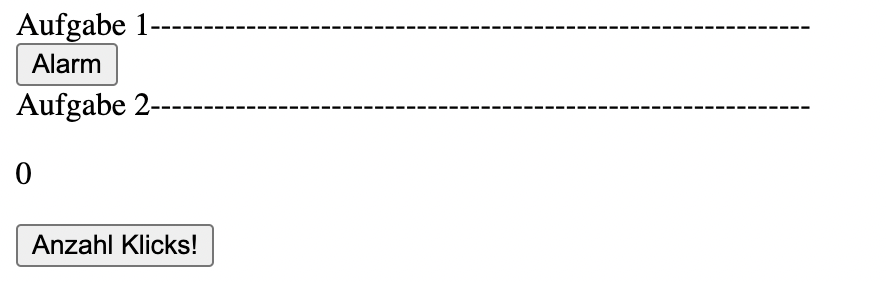
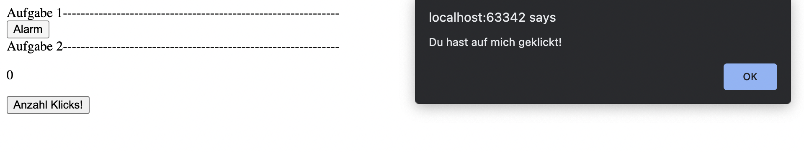
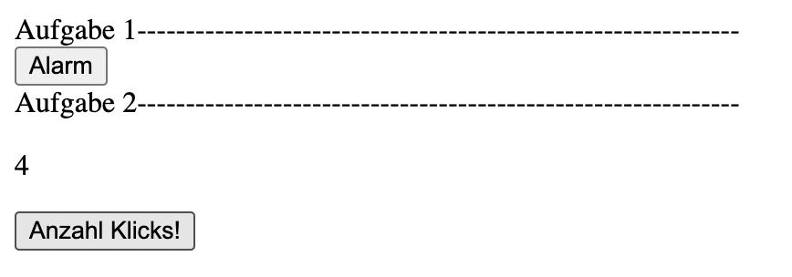

# React

Hinweise zur Bearbeitung:

- Dies ist eine Übungsaufgabe und dient nur als **Zusatzaufgabe**. Das Bearbeiten der
  **Einkaufslistenapp** ist das jeweilige Ziel der einzelnen Lektionen und sollte als Priorität angesehen werden.
- Achte auf einen sauberen Quellcode, insbesondere Einrückungen sind wichtig!

---

## Lektion 4a - Übungsaufgaben

1. Schauen wir uns nun einmal einen Knopf an, der es uns sagen kann, ob wir auf ihn gedrückt haben. Hierzu benutzen wir
das neu gelernte `onClick` Event. Schreibe also als Erstes eine `clickHandler` Funktion. Diese soll einen Alarm zurückgeben,
welcher sagt: `Du hast auf mich geklickt!`. Anschließend programmiere einen `button`, welcher die vorher geschriebene `clickHandler` Funktion
in dem `onClick` Event verwendet! Nenne den Button `Alarm`.  
**Hinweis:** Das onClick event muss wie folgt im Button stehen: <button `hier das Event`>Alarm</button>
---

2. Nun schauen wir uns nochmal einen Button an, welcher zählen kann, wie oft du auf ihn geklickt hast! Schreibe hier in den vorgegebenen
Code zuerst den aktuellen `State` des `counter` und dann einen `button` mit einem `onClick` Event. Dieses soll auf die vorgegebene
increment Funktion zugreifen. Nenne den Button `Anzahl Klicks!`

___
##Endergebnis
Am Ende sollte das Ganze ungefähr so aussehen:  
>  
Beim Clicken auf Alarm sollte das hier passieren:
  
Nach 4 Klicks sollte er Zähler ungefähr so aussehen:
  
