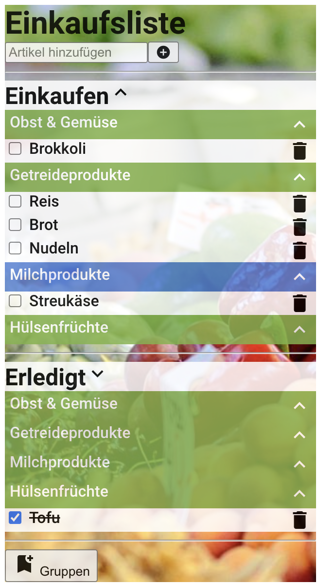
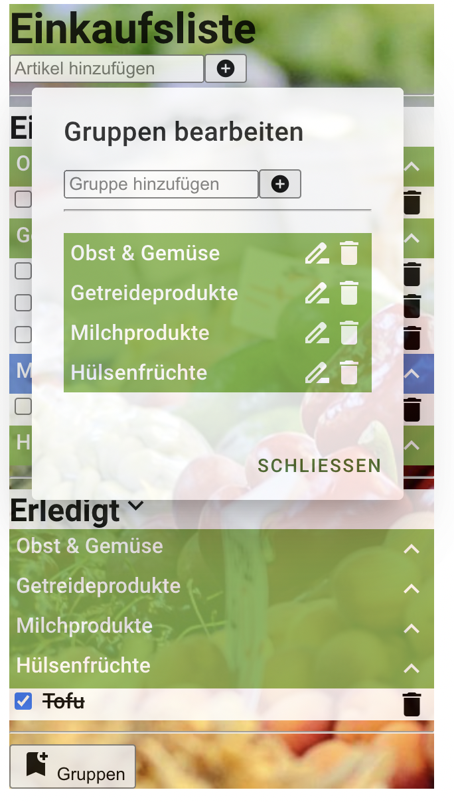
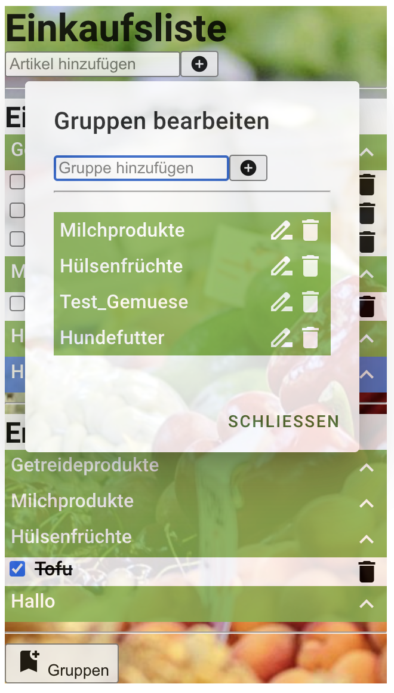

# React

Hinweise zur Bearbeitung:

- Achte auf einen sauberen Quellcode, insbesondere Einrückungen sind wichtig!
- Wir übernehmen den HTML code für den Gruppen Dialog laut Aufgabenstellung NICHT sonder bauen ihn Stück für Stück in
  React nach. Du kannst dich natürlich trotzdem an deinem HTML code orientieren und so viel wie möglich übernehmen!
- Jede Komponente sollte in einer eigenen .js Datei deklariert werde. Diese werden dann mit script tags importiert
- HTML und JSX sind sehr ähnlich aber nicht gleich. Du musst eventuell einige Kleinigkeiten anpassen damit dein HTML
  code angezeigt wird. Die Fehlermeldungen in der JS Konsole können dir dabei helfen.
- Beim Auslesen eines Textes den der Nutzer eingeben kann macht es meistens Sinn den text zu "cleanen", also z.B.
  Leerzeichen vorne und hinten zu entfernen und zu überprüfen ob der Text in dem gegebenen Kontext überhaupt Sinn macht(
  z.B. ob er leer ist)

---

## Lektion 5

1. Erstelle eine eigene Komponente namens `GruppenDialog`. 
   1. Erstelle für diese Komponente einen Konstruktor. 
   In diesem sollte der state der Komponente gesetzt werden. Dieser sollte aus 2 Attributen bestehen:

      - showDialog, welches der `visible` property entspricht.
      - gruppenListe, welches der `gruppenListe` property entspricht.
   2. Importiere diese Komponente in deiner HTML-file mit einem script-Tag
   3. Schreibe nun die `render()`-Methode. Die Komponente solle aus 3 geschachtelten, 
   alles umschließenden `
` tags mit folgenden `className` Attributen bestehen:

      - Äußerstes `
` : `mdc-dialog mdc-dialog--open` wenn die visible property des GruppenDialogs `true` ist, und 
      nur `mdc-dialog` sonst(über die mdc-dialog--open Klasse wird die Sichtbarkeit des Dialogs gesteuert)
      - Mittleres `
` : `mdc-dialog__container`
      - Innerstes `
` : `mdc-dialog__surface`

### Zwischenergebnis
Deine App sollte sich bisher nicht verändert haben

---

2. Gehe nun zu `ShoppingTag.js`
   1. Füge dem state von `ShoppingTag` eine Variable `showGruppenDialog` hinzu, die standardmäßig false ist 
   2. Im Footer, also nach allen relevanten Komponenten, nutze das `GruppenDialog` Tag mit folgenden properties:
      - `visible:`, welche gleich dem state Variable showSetupDialog ist. 
      - `onDialogClose:` eine Pfeilfunktion die mithilfe der `setState` Funktion die `showGruppenDialog` Variable auf 
      `false` setzt. 
   3. Programmiere außerdem den Button, der den Dialog öffnen soll. Dies sollte mithilfe einer Pfeilfunktion geschehen. 
   Durch den Klick soll mithilfe der `setState`-Funktion die `showGruppenDialog` Variable auf true gesetzt werden.  
   Setze innerhalb der 
   4. **Zusatz**: Bei diesem Button kannst du ein Icon durch hinzufügen von ``-Tags hinzufügen. Das Icon kann durch 
   die property ``className="material-icons"`` angezeigt werden. Im Körper (body) der Funktion muss dieser Ausdruck
   eingefügt werden: ``bookmark_add``

### Zwischenergebnis
Die EinkaufslistenApp sollte nun in der Ecke unten-links einen Button "Gruppe" haben. 
Durch Klicken des Buttons passiert bisher nichts. 
>
---

3. Folge nun folgenden Schritten in `GruppenDialog.js`:
   1. Schreibe die Überschrift für das Dialog Fenster innerhalb der divs in ein `<h2>` tag mit `className` `mdc-dialog__title`. 
   2. Nun folgt ein `
` tag mit `className` `mdc-dialog__content` in welches der Hauptbestandteil des Dialogs kommt, also 
   alles was bei HTML im header und main Bereich wäre. 
   3. In diesem `
`-Tag sollte ein `<nav>`-Tag sein welches wiederrum ein Textfeld und einen Button enthält. Das Textfeld 
   sollte eine sinnvolle `id` haben und der button sollte wenn er geklickt wird, die `gruppeHinzufuegen()` Methode 
   aufrufen (siehe Abschnitt 4). 
   4. Nun folgt zur Trennung eine horizontale Linie und die Auflistung der Gruppen. Nutze für diese ein `<dl>` Tag, mit 
   dem `className` `mdc-deprecated-list`. Erzeuge die Listenelement mit der `gruppenListe` aus dem state und einer `map`
   Funktion. Jedes Listenelement sollte besten aus:
      - einem alles umschließendem `<dt>` tag, mit der Gruppen id als `key`
      - einem `` tag, welches den Gruppen Namen enthält
      - einem icon(`<i>`) welches wenn es geklickt wird die `gruppeBearbeiten` Funktion mit der Gruppen id als Parameter(siehe
        Abschnitt 4) aufruft
      - einem icon(`<i>`) welches wenn es geklickt wird die `gruppeEntfernen` Funktion mit der Gruppen id als Parameter(siehe
        Abschnitt 4) aufruft 
   5. Nun folgt ein `
` tag mit `className` `mdc-dialog__actions` in welches die abschließenden Funktionen kommen, also 
   alles was bei HTML im footer Bereich wäre(also ist das `mdc-dialog__content` hier vorbei). 
   6. In diesem `
` sollte sich nur ein button befinden, mit dem `className` `mdc-button mdc-dialog__button`, der wenn er 
   geklickt wird, die Funktion die als property `onDialogClose` mitgegeben wurde aufruft (siehe Abschnitt 4). 
   Dieser button enthält wiederrum ein `` tag mit `className` `mdc-button__label` welches die 
   Beschriftung des buttons entält.

Für genauere Erklärung,
siehe [Material.io Dokumentation zu Dialogen](https://material.io/components/dialogs/web#using-dialogs)

### Zwischenergebnis
Durch diese Schritte hat der Button nun eine Funktion.  
Es öffnet sich ein Dialog-Feld mit allen bisherigen Gruppen. Das Klicken auf das Entfernen und Bearbeiten der einzelnen 
Gruppen, gibt eine Fehlermeldung, da die Funktionen `gruppeHinzufuegen`, `gruppeEntfernen`, `gruppeBearbeiten` und 
`onDialogClose` bisher nicht implementiert wurden.  Dies holen wir im nächsten Schritt nach.
>

---

4. In den folgenden Schritten implementierst du die einzelnen Funktionen. Jede Funktion kannst du direkt testen und 
sollte keine Fehlermeldungen ausgeben.
   1. **gruppeHinzufuegen**:  
   Liest das Textfeld aus(`document.getElementById`) und nutzt die Methoden des App Objekts um eine Gruppe mit dem
  ausgelesenen Namen hinzuzufügen. Nutzt außerdem die `setState` Funktion um die `gruppenListe` im state der Komponente
  zu aktualisieren. Setzt im Anschluss den Inhalt des Textfeldes zurück und benutzt die `focus()` Methode um das
  Textfeld auszuwählen.
   2. **gruppeEntfernen**:
   Erhält als Parameter eine Gruppen id und nutzt die Methoden des App Objekts um die entsprechende Gruppe zu entfernen.
  Nutzt außerdem die `setState` Funktion um die `gruppenListe` im state der Komponente zu aktualisieren.
   3. **gruppeBearbeiten**:
   Erhält als Parameter eine Gruppen id und liest das Textfeld aus(`document.getElementById`). Nutzt dann die Methoden
  des App Objekts um die entsprechende Gruppe zu dem ausgelesenen Text umzubenennen. Nutzt außerdem die `setState`
  Funktion um die `gruppenListe` im state der Komponente zu aktualisieren. Setzt im Anschluss den Inhalt des Textfeldes
  zurück und benutzt die `focus()` Methode um das Textfeld auszuwählen.
   4. **onDialogClose**: 
   Dies ist eine Pfeilfunktion die in `ShoppingTag.js` der `GruppenDialog` Komponente mitgegeben wird, die
  mithilfe der `setState` Funktion die `showGruppenDialog` Variable auf `false` setzt.

---

## Endergebnis

Du solltest jetzt in der Lage sein über den entsprechenden Knopf unten in der App den Gruppen Dialog zu öffnen. über diesen solltest du folgende Funktionalitäten nutzen können:
- Gruppen hinzufügen
- Gruppen umbenennen
- Gruppen entfernen
Das Endergebnis sollte ungefähr so aussehen(mit geöffnetem Dialog):

>
